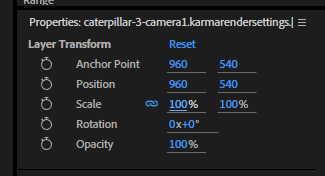
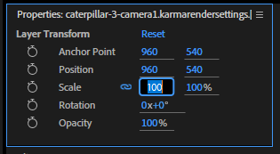

# @leviathanbadger/cc-web-components

Experimenting with Codex to create WASM user controls/components mimicking some of the controls in Adobe
CC products, written in Rust.

One of the things I love about the Adobe Creative Cloud software is that there are new, very novel user
components that make it easy and intuitive to work with data and information that otherwise don't have a
standardized way to interact.

For example, if a user needs to enter a number that corresponds to a visual element with a continuous
property (not discrete steps), the standard way to implement that is to have a textbox that needs to be
parsed to a number. To change the value to see its effect, you have to literally type in a new number
each time, which prevents the value from being changed gradually and continuously. It also forces the
user to have an understanding of what the number's units represents, and very small changes or very
large changes can be hard to do because the user must change many digits, or digits far away from the
decimal point.

To contrast, in Adobe CC products, if you need to change a number, you can click and drag left+right to
shift the value continuously, allowing you to watch the results and intuitively pick the correct value
without having to understand the unit involved.



You can still click the number and type in a new value if you have to use an explicit value, but the
drag-to-change is a much more intuitive way to change the value when working on a visual element.



This is a very simple example, but there are many other components that are very useful and intuitive
to use. I want to create a library of these components in Rust, using WebAssembly to run them in the
browser. This will allow for high-performance, interactive user interfaces that can be easily
integrated into web applications. They'll show up as native components in the browser, using the shadow
DOM to keep usage simple, and can be used in any web application that supports WebAssembly, with any
framework, regardless of the underlying technology stack.

This project is mostly for fun. I want to learn or practice several new technologies, including Rust,
WebAssembly, the shadow DOM, the pointer events API, pointer lock, and modern web development techniques.
I may also use the Houdini CSS APIs to create CSS properties and animations customized for these
components. Finally, I'm intending to see how much of this can be automated using Codex, and how much
babysitting is required to get it to work.

## Getting Started

This repository is set up as an NPM package using [Vite](https://vitejs.dev/) for development and bundling. Once dependencies are installed you can start the dev server with:

```bash
npm run dev
```

The example page under `examples/basic-demo` will be served so you can experiment with the components during development.

For a framework example, a basic React app lives under `examples/react-app`. Run
`npm install` then `npm run dev` inside that directory to see the components used
within React.

Building the library outputs the bundled files to `dist/`:

```bash
npm run build
```

Run `npm run test` to execute the test suite.
Linting is performed on both TypeScript and Rust code using ESLint, rustfmt and
clippy. Install the Rust components with `rustup component add rustfmt clippy`.
Run `npm run lint` to check formatting and common issues.

## Draggable Number

`<cc-draggable-number>` is an input that allows changing numerical values by
clicking and dragging. It supports a `type` attribute that controls how the
value is formatted and interpreted:

- `raw` – the value is displayed as-is.
- `whole-rotation` – shows the number of complete `360°` rotations of the
  value.
- `part-rotation` – shows the remaining degrees after removing complete
  rotations.
- `percent` – displays the value multiplied by `100` and parses input as a
  percentage.

Optional `min` and `max` attributes can constrain the value. When omitted,
no bounds are applied.

All input components also support a `disabled` attribute that prevents
interaction and mirrors the semantics of native form controls.

The overlay input used when editing is absolutely positioned, so place
`cc-draggable-number` inside a relatively positioned container to keep the
overlay aligned.

## Rotation Property Input

`<cc-rotation-property-input>` displays an angle as full rotations and partial degrees.
The value is shown in the format `Nx±D°`, where `N` is the number of full `360°` rotations
and `D` is the remaining degrees. Internally it uses `cc-property-input` with two nested
`cc-draggable-number` elements.
`min` and `max` attributes are forwarded to both numbers. The `disabled`
attribute disables all nested inputs.

```html
<cc-rotation-property-input value="390"></cc-rotation-property-input>
```

The example above renders the value as `1x+30°`.
## Percent Property Input

`<cc-percent-property-input>` displays a numeric value as a percentage.
The component maps its internal value from the range `0`–`1` to display
`0`–`100` without clamping. Internally it uses `cc-property-input` with a
single `cc-draggable-number` element configured with `type="percent"`.
`min` and `max` attributes are passed through to that element. The `disabled`
attribute disables the input.

```html
<cc-percent-property-input value="0.35"></cc-percent-property-input>
```

The example above renders the value as `35%`.
## Project Plan

For the full development plan and design details, see [PROJECT-PLAN.md](./PROJECT-PLAN.md).

## Documentation

Documentation is generated using [Docusaurus](https://docusaurus.io/).
Run `npm run docs:build` to build the static site. The generated files are
published automatically via GitHub Actions on every push to `master`.
